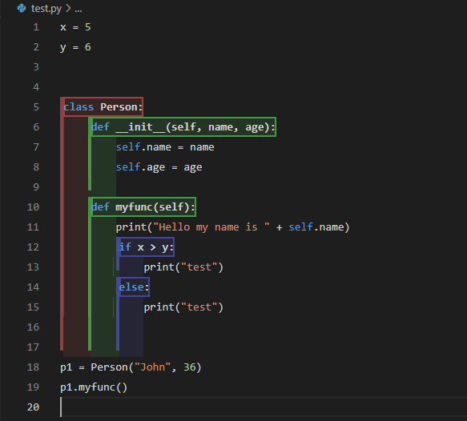

# code block visualization README

In the past decade there has been a rise in visual programming IDEs, e.g. Snap (2020),
Blockly (2019), Pencil.cc (2015), Scratch (2013). Research has shown that these IDEs can
be effective as a learning tool for Computer Science students when learning programming. 
The visualization of codeblocks by these visual IDEs provides students with a deeper understanding of program structure.

However, most programming languages do not have a visual programming IDE translation
and the few that do, can only provide this for a limited subset of features for that programming language. Developing and maintaining a visual programming alternative for every
major programming language might not be feasible.

An extension is created in VS Code that provides code block visualization for a popular programming language (python) that can be easily and quickly adjusted to work as well for other programming languages (Javascript, Typescript, C#, ...).

## Features

Highlight codeblocks in Python, based on block type. 

## Extension Settings

Customization of colors, supported languages and block types will follow soon.

## Known Issues

 - On initialization, the extension will sometimes not recognize all blocks, rendering them all in the same color.

## Release Notes

Users appreciate release notes as you update your extension.

### 0.0.1

Initial alpha release.

### 0.0.2

bug fixes:
 - fixed auto-save to happen after a delay of 500ms

### 0.0.3

bug fixes:
 - fixed bug where blocks would only get partially rendered when the last line of the file is part of a block

### 0.0.4

bug fixes:
 - fixed bug where undo/redo states were created when creating the code block vizualizations, creating a much larger undo/redo stack then necessary

### 0.0.5

bug fixes:
 - redo fixed